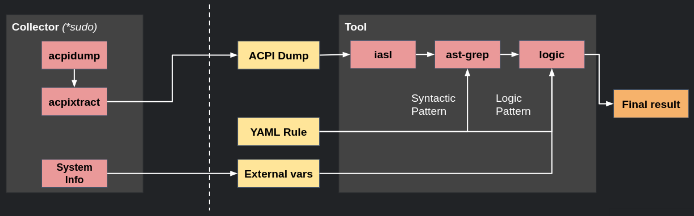

# ACPIXM - ACPI Rootkit Detection Tool

**A**bsolutely **C**ritical **P**attern **I**dentifier for **M**alware

A comprehensive tool for collecting and analyzing ACPI tables to detect potential security indicators and rootkit behavior in system firmware.

## Features

- **ACPI Table Collection**: Dumps and disassembles ACPI tables from the system
- **Custom ASL Grammar**: Custom ASL tree-sitter grammar to parse over asl files
- **Pattern Detection**: Uses AST-based pattern matching with custom rules
- **Multiple Output Formats**: Console (pretty) and JSON output formats
- **Extensible Rules**: YAML-based rule system with logic evaluation
- **Pipeline Architecture**: Modular, extensible data processing pipeline

### To do list:
This still work in progress, i am thinking about some ideas to improve the project.
- [TODO.md](./TODO.md)

## Installation

### Prerequisites

ACPIXM shells out to two external tools that `uv` does **not** install for you —
you must install them separately:

| Tool | Needed for | Install |
|---|---|---|
| `acpica-tools` (`acpidump`, `acpixtract`, `iasl`) | `acpixm collect` | `sudo apt install acpica-tools` |
| `ast-grep` | `acpixm analyze` | see below |

(A future release will bundle `ast-grep` as a Python dependency so `analyze`
works out of the box — for now install it yourself.)

#### 1. Install ACPICA Tools (for ACPI table manipulation)

**Ubuntu/Debian:**
```bash
sudo apt update
sudo apt install acpica-tools
```

#### 2. Install ast-grep (for AST pattern matching)

Follow instructions from official repo: [ast-grep/ast-grep](https://github.com/ast-grep/ast-grep)

```
npm install --global @ast-grep/cli
pip install ast-grep-cli
brew install ast-grep
```

#### 3. Install uv (Python package manager)

Follow instructions from official repo: [astra-sh/uv](https://github.com/astral-sh/uv)

```bash
curl -LsSf https://astral.sh/uv/install.sh | sh
source ~/.bashrc  # or restart your terminal
```

### Install ACPIXM

`uv tool install` puts `acpixm` on your PATH in its own isolated environment —
no virtualenv to create or activate.

```bash
# Option A — install directly from GitHub
uv tool install git+https://github.com/manugcr/acpixm

# Option B — from a local clone
git clone https://github.com/manugcr/acpixm.git
cd acpixm
./install.sh          # wraps: uv tool install . --force
```

### Verify Installation

```bash
# Check if acpixm is available
acpixm --help

# Verify external dependencies
acpidump --help     # Should show ACPICA tools help
ast-grep --version  # Should show ast-grep version
```

## Usage

### 1. Collect ACPI Data

First, collect ACPI tables and system information (requires sudo):

```bash
sudo acpixm collect --output ./data
```

This creates:
- `*.dsl` files: Disassembled ACPI tables
- `systemdata.json`: System variables for logic evaluation

### 2. Analyze with Rules

Analyze the collected data using detection rules:

```bash
# Console output (pretty formatted)
acpixm analyze --rule examples/OpRegionSuspicious.yml --files ./data

# JSON output (for automation)
acpixm analyze --rule examples/OpRegionSuspicious.yml --files ./data --format json

# With external variables
acpixm analyze --rule examples/OpRegionCritical.yml --files ./data --vars ./data/systemdata.json
```

### 3. Example Rule Structure

Rules are defined in YAML format:

```yaml

# AST pattern matching
ast:
  id: opregion-kernel-space
  language: asl
  message: OperationRegion pointing to kernel space
  severity: warning
  rule:
    pattern: OperationRegion ($REGNAME, SystemMemory, $OFFSET, $LENGTH)

# Optional logic evaluation
logic:
  - id: operating-region
    make-range: [$OFFSET, $LENGTH]
  - id: kern-code
    overlaps: [operating-region, $KERNEL_CODE_RANGE]
# Return conditions
return:
  - found: kern-code
  - not-found: otherwise

```

## Rule Examples

The `examples/` directory contains several detection rules:

- `OpRegionCritical.yml`: Detects suspicious operations over kernel memory regions
- `OpRegionSuspicious.yml`: Detects suspicious operations over other memory regions.
- `LoadStore.yml`: Identifies dynamic code loading patterns
- `StoreCode.yml`: Finds code modification attempts

## Development

### External Tools

- **acpica-tools**: ACPI table manipulation (`acpidump`, `iasl`)
- **ast-grep**: AST-based pattern matching with custom grammar
- **tree-sitter-asl**: Custom ASL grammar for ast-grep

### Project Structure

```
├── src/acpixm/                 # Main package
│   ├── cli.py                  # Command-line interface
│   ├── acpi_analyzer.py        # Main orchestrator
│   ├── data_provider/          # Data collection pipeline
│   ├── acpi_matcher/           # Pattern matching and logic
│   └── formatters/             # Output formatting
├── examples/                   # Example rules and snippets
├── tree-sitter-asl/            # Custom ASL grammar
```

### Project Diagram



---

## Sources

Thanks to John Heasman for the research over ACPI, and Michael Denzel for extending this research and developing a tool to catch some of this ideas, this was based over that.
- [bh-eu-06-Heasman](https://www.blackhat.com/presentations/bh-europe-06/bh-eu-06-Heasman.pdf)
- [ACPI-rootkit-scan](https://github.com/mdenzel/ACPI-rootkit-scan)